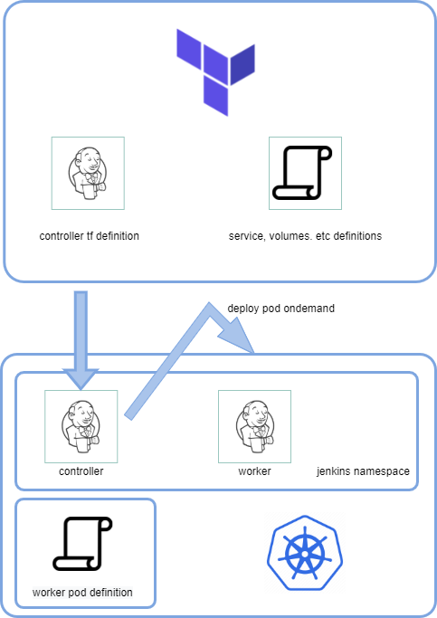

# TLDR
Repo has a set of terraform objects to deploy and use jenkins in k8s cluster
Test pipeline is included to present CI/CD for small golang project 
https://github.com/minamijoyo/myaws


# Prerequisites

The repo considers the k8s cluster exists and configured. Tested in `minikube`
`provider.tf` resource expects kubeconfig being located in default place (`"~/.kube/config"`)
and proper context is selected by specifying variable `k8s_context` in `vars.tf`. 
This variable is fist in the list of variables for simplicity

# Architecture


Jenkins controller stateful set deployed to Kubernetes by terraform, using jenkins controller

jenkins workers are deployed to k8s by Jenkins kubernetes plugin

Custom container images are used in pipelines 

Building  docker containers are done by docker dind 


# Deployment

```
terraform init
terraform plan
terraform apply
```

terraform k8s provider is used and all kubernetes objects needed for jenkins (secrets, config-maps, services etc) 
are covered by terraform standard terraform resources. 

# Configuration

Configuration and fine tuning of the kubernetes resources can be done via `vars.tf` and hardcoded values in resources them self.

Jenkins configuration is done via JCASC template, where all Jenkins config values specified, including password, test pipeline and k8s containers used in test pipeline. 

jcasc template is located in `templates/jcasc-default-config.tmpl`

To add new plugins to Jenkins init container is used. It parses `templates/plugins.txt` and installs plugins and versions, specified there.
The templates are mounted to k8s containers as configmaps and later used by k8s containers.

TODO: make template more flexible and configurable

## Password customization

By default Jenkins password is generated by terraform, stored in kubernetes secret and then used by JCASC via mounting secret file.
This approach considered pretty secure if you trust k8s secrets.
However password can be setup by user with specifying `jenkins_password` variable like `terraform plan -var 'jenkins_password=YouPasswordHEre'` or tfvars
or by modification of default. However, this feature if pretty synthetic.

# Connect

Jenkins service exposed as NodePort at selected port `30080`. If this port is busy different one can be selected by variable `controller_node_port`
For minikube  ` minikube service list  | grep -e 'jenkins ' | awk -F'|' '{print $5}'` can be used to found Jenkins url. Default username is admin.


### How to get generated password

Password can by get from k8s secrets, but to simplify operations output is created. To get the password from output something like this can be used after
successful apply
` terraform output  -raw  jenkins_password`

TODO: In case of cloud deployment, consider cloud secrets storage (AWS SSM Parameters Store or AWS Secrets Manager)

# Test pipeline

### Why myaws

For test pipeline it was a good idea to use something simple and lightweight, and compiled languages are usually better from this perspective. 
That's why golang was selected, and project selected is pretty random. It's maintained pretty regularly and uses modern libraries, it's small, lightweight 
and produces simple binary after compilation and has no jenkins automation in place. 

### Pipeline steps

MyAws have some generic CI/CD, created by gitlab actions. The same steps are provided in test pipeline, for visibility they are optional. 
Pipeline steps are run in specific containers each. The container specified in JCASC at startup.

TODO: create and use specific containers. Installing things to container at runtime is not good. 

1. Lint. Actually linter is not happy about myaws code. That's why it's disabled by default. 
golangci/golangci-lint container is used for this step. `golangci-lint` binary is used with default parameters to check the codebase. 

1. Test. golang container is used for this step and some build-essentials components are added at runtime. Later proper container should be build, having go container as a base image and all things needed should be already there. 
Tests are run by Makefile instruction provided by code developer. 

1. Build. docker-dind container is used to build docker container for the repo. Dockerfile provided by repo developer. Container name and container labels are configurable by env variables. 

TODO: container label should be changed in code or by Jenkins, not hardcoded in Jenkinsfile. 
TODO: later the step should put built container to docker registry by choice. 


# NEXT STEPS:

## Automate k8s installation

1. Consider which k8s cluster should be used
1. Add optional terraform repo to deploy the cluster

## Make solution more flexible and ready for prod k8s clusters

1. Test solution in different k8s installations (tested in minikube)
1. Add optional steps for cloud based installations (loadbalancer, pvc/storage-class)
1. Consider caching, reusing volumes for build containers to make builds faster


## Harden Jenkins installation. 

1. https endpoint
1. Review Jenkins ClusterRole
1. Consider more protected access to k8s api
1. Inspect controller-worker connection
1. Consider upgrade for jenkins containers (controller, worker, specific build containers)

## Improve pipeline


Current pipeline is pretty synthetic
More steps needed to make it better

1. Put built docket image to docker registry
1. Deploy to different namespace to k8s having release strategy in mind

